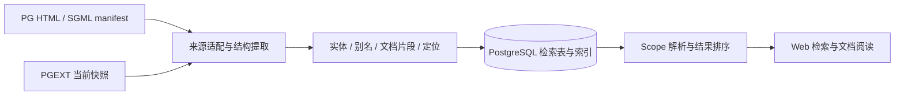

# PostgreSQL 专用文档检索设计草案 · 2026-09-09

用户确认的交付形态为 Web + 后端 + PostgreSQL 数据库。本文是设计与计划，依据当前本地 PGWeb、pgdoc、Dash docset 的只读检查及上游资料撰写；未实现检索服务，未修改数据库或部署生产。

实现进展：同日已在 `codex/dash-doc-search` 分支完成 PG 官方手册检索的本地版本，操作与验证见 [文档检索说明](document-search.md)。下文保留设计时的方案；实现采用两个派生表，扩展目录联合检索、语义搜索与版本差异仍属于后续工作。

建议把产品定位为“理解 PostgreSQL 实体、版本和语言的文档检索”。主要投资放在确定性的实体提取、定义定位、版本约束和检索排序；完整正文始终可以检索，精确实体命中作为增强结果。

2026-09-09 策略调整：三方组件文档仅保留外部 URL 入口，原三表及导入、阅读实现已归档撤回。本站检索仅覆盖 PostgreSQL 手册正文与 PGEXT 扩展目录元数据。扩展正文副本也已删除，不抓取或索引任何外链正文；扩展目录只提供中文概览、关联和外链。

当前已有的内容和结构足以支撑第一版。

| 当前本地依据 | 观察 | 设计意义 |
| --- | --- | --- |
| `docs` / `DocPage` | PG14–18 共 5,605 条记录；PG18 为 1,151 条，其中 1,148 个 HTML 页面；PG18 原始 content 约 15.8 MiB | 可以直接适配已有正文；记录数包含 SVG，不能全部称为文档页面 |
| `core_version` | 本地 current 是 PG18；PG19 标记 beta；同时存在 tree=0 的 devel 数据 | 默认版来自配置；开发版显式选择；处理别名与重复版本 |
| `pgext.universe` | 设计时快照为 2,355 条；`pgext.doc` 副本已撤回 | 扩展名称、双语简介和元数据可检索；不索引外部手册正文 |
| `pgweb/search/views.py` | 旧搜索通过 `SEARCH_DSN` 调用 `site_search()`；另有邮件列表搜索分支 | 新增文档检索后端，逐步接入文档入口；邮件搜索属于另一项功能 |
| 已安装扩展 | 本地目标库有 `pg_trgm`，未安装 `pg_search` / PGroonga | 原生基线可以先做；候选正文引擎需要单独验证 |

以上数字是设计时的本地状态，不代表生产状态，也不是性能测试结果。只有有可用本站阅读地址的内容才进入公开检索。

本机 Dash docset 与截图计数完全一致：Function 2,478，Query 476，Setting 431，Type 198，Procedure 56，Error 262 等。但 Function 中存在 `The Password File` 和 `Dynamic Loading`，Procedure 中存在 `Checking Assertions`；名称、别名、主题与多处定位混合计算。不能把这些数字视为 PG 函数、过程或命令的实际数量。Dash 的公开 docset 结构主要是 `name/type/path`，路径可带锚点；我们可以借鉴其检索交互，并建立更精确的 PG 分类。[Dash docset 格式](https://kapeli.com/docsets)

需要先约定三个不同概念：**scope 决定搜索哪一组文档；kind 决定实体是什么；topic 表示内容谈什么。** 例如 `pg18:` 是文档范围，`function` 是实体类型，`replication` 是主题。复制、备份、性能优化适合成为主题筛选，不能替代函数、命令、参数等实体类型。

建议的 scope 行为如下。

| 输入 | 行为 |
| --- | --- |
| `work_mem`、`逻辑复制槽` | 全文检索默认启用的文档集合，同时提升匹配的实体定义 |
| `pg:` | 进入当前默认 PG 大版本；本地目前解析为 PG18；无查询词时显示分类、常用入口与数量 |
| `pg: work_mem` | 当前默认 PG 大版本中的参数定义及正文 |
| `pg18:`、`pg17:`、`pg16:`、`pg15:`、`pg14:` | 严格限定对应大版本；使用该大版本已导入的文档快照 |
| `pg19:` | 仅在已启用该版文档时可用，显式显示 beta / devel 状态 |
| `ex: hnsw` | 扩展名称、简介和元数据，结果链接到本站扩展概览 |
| `pg18: kind:guc work_mem` | 可选高级语法；普通用户也可点“参数”筛选完成同一操作 |

默认全局集合取 PG 当前稳定版及扩展目录的当前快照。历史版本通过显式 scope 或版本筛选访问，避免首页铺满同一段内容的五个版本。若开放“所有版本”，同一实体折叠展示，版本入口可以展开。阅读 PG17 时，页内检索可预填可见的 `pg17:` chip；不能悄悄改变全局 `pg:` 的含义。

Scope 是一个小型注册表：别名映射到 corpus 过滤条件。初版用受版本管理的配置即可，不需要为 `pg14` 到 `pg19` 分别建表。`pg`、`pg14` 到 `pg19` 和 `ex` 是本站文档范围；外链组件不注册检索 scope。未来支持用户自定义别名时再增加持久化配置。

只解析输入开头的已注册 scope，允许冒号后无空格。未知的前缀保留原始查询并给出提示；已识别组件的未收录版本应明确显示不可用。`::`、`postgresql://`、`host:port`、代码字符串中的冒号不能被误吞。明确选择 PG17 后，无结果时可提供“在当前版搜索”的按钮，结果列表仍保持 PG17 的边界。

PG 的实体可以分层收录。界面按少量大类分组，下面的细类保留为 subtype 和筛选项；不必把每种细类都放成一个常驻标签。

| 实体族 | 例子与细类 | 提取来源与边界 | 优先级 |
| --- | --- | --- | --- |
| 配置参数 | `work_mem`、`wal_level`、`pg_stat_statements.track` | GUC 定义列表；区分核心与模块配置 | P0 |
| SQL 命令 | `CREATE TABLE`、`ALTER SYSTEM`、`EXPLAIN` | `refentry`、`refname`、`refpurpose`、synopsis；一条命令聚合语法变体 | P0 |
| 函数与例程 | `jsonb_set`、`pg_size_pretty`、`count`、`row_number` | 函数定义表、聚合、窗口、管理函数；过程保留 subtype；按签名区分重载 | P0 |
| 运算符 | `->>`、`@>`、`<->`、`~*` | 运算符定义表；记录左右操作数类型及返回类型 | P0 |
| 数据类型 | `integer` / `int4`、`jsonb`、`timestamptz`、range、pseudo-type | 类型表与章节；别名合并；`serial` 标记为类型写法 / 语法糖，不冒充独立运行时类型 | P0 |
| 错误条件 | `23505` / `unique_violation`、`40P01` / `deadlock_detected` | 错误码附录与对应版本 `errcodes.txt`；SQLSTATE 使用字符串；同时覆盖 warning 和错误类 | P0 |
| 系统关系 | `pg_class`、`pg_stat_activity`、`information_schema.columns` | 系统目录、系统视图、统计视图、信息模式；保留 namespace 和 subtype | P0 |
| 工具与交互命令 | `pg_dump`、`pg_basebackup`、`psql`、`\d+`、`\watch` | 客户端 / 服务端 reference 与 psql meta-command 定义；命令选项作为成员 | P1，psql 常用命令可前置 |
| 其他配置项 | `fillfactor`、`sslmode`、`PGHOST` | 关系存储参数、libpq 连接参数、环境变量；与 GUC 用 subtype 区分 | P1 |
| 扩展与模块 | `pg_trgm`、`postgres_fdw`、`auto_explain`、`vector` | 官方附录和 PGEXT；可加载模块与 SQL extension 区分，不能默认都有 `CREATE EXTENSION` | P1 |
| 访问方法 | `btree`、`gin`、`brin`、`heap`；扩展中的 `hnsw` | AM 统一类别，细分 index / table；保持所属项目和定义版本 | P1 |
| 过程语言 | `plpgsql`、PL/Python、PL/Perl、PL/Tcl | 语言章节与文档化特性；可信 / 不可信变体按来源记录 | P1 |
| SQL 语法与子句 | `ON CONFLICT`、`LATERAL`、`FILTER`、`OVER`、`COALESCE` | 明确文档化的语法结构；`COALESCE` 等特殊表达式单独标记，不能要求都存在于 `pg_proc` | P1 |
| 操作符类与族 | `jsonb_path_ops`、`gin_trgm_ops`、`vector_l2_ops` | AM 与扩展手册；表达索引方法和数据类型的关系 | P1/P2 |
| 等待事件与锁 | `ClientRead`、`WALWrite`、`AccessExclusiveLock` | 监控、锁章节及对应版本结构化源；wait event 名称带 wait type 上下文 | P1/P2 |
| 计划节点 | `Hash Join`、`Bitmap Heap Scan`、`Index Only Scan` | EXPLAIN、执行器章节；先收录有定义和说明的节点 | P2 |
| 认证与预定义角色 | `scram-sha-256`、`peer`、`pg_monitor`、`pg_read_all_data` | 认证、角色与权限章节；角色权限随版本展示 | P2 |
| 文件与协议 | `pg_hba.conf`、`.pgpass`、`standby.signal`、复制协议命令 | 文件章节和协议定义；更细的协议消息、libpq C API 放在开发者筛选中 | P2 |
| 概念与指南 | MVCC、WAL、HOT、TOAST、PITR、VACUUM、逻辑复制 | 标题、glossary、acronyms、`indexterm`、bookindex；支持双语名称和缩写 | 全文从 P0 覆盖，语义整理逐步完善 |

Catalog 的边界建议定为“文档化的对象和必要成员”。完整收录手册已经解释的系统目录 / 视图名称并不困难，本地 PG18 有 64 个 `catalog-pg-*` 页面；按 `view-pg-*` 文件名统计还有 37 页，但这个口径不包含所有监控统计视图。列定义可全部作为成员片段收录，但默认结果以关系为主，只有输入 `pg_stat_activity.wait_event` 或明确搜索列时提升成员。无需导入对象实例、用户 schema、OID 全量数据、内部支撑函数和所有目录关系。这样既能查列，也能避免 `oid`、`name`、`id` 把普通结果淹没。

实体身份必须比文本匹配更严格。

- `count(*)` 和各重载属于同一函数族；展示时可折叠，签名、返回类型和版本不能混为一条属性。函数、聚合、窗口函数和真正的 procedure 有不同 subtype。
- `@>` 对不同操作数类型有不同定义，精确搜符号后应展示签名供选择。
- `work_mem` 作为 GUC 与 SQL 中偶然出现的变量名，分别是定义和提及。
- `ttl` 在 Patroni 与其他组件中可能同名，实体键必须包含项目 / namespace。
- `int4` 与 `integer` 可以是同一类型的别名；“缓存”和 `shared_buffers` 只是相关概念，不能强行声明为等价名称。
- `VACUUM` 既有命令定义又有维护主题；结果应显示不同类型，并提供互相参见。
- 语言翻译不产生一个新的逻辑实体；名称与签名作为技术标识保留，中文标题和描述作为展示与召回内容。
- 规范化按实体类型处理：SQL 命令和 GUC 名称可建立大小写折叠键；psql 的 `\dD` 与 `\dd`、带引号标识符、环境变量和 API 名称需要保留大小写语义。不能全库统一小写或统一去标点。

实体提取应以可重复的结构规则为主。PG 手册本身有 DocBook / SGML 语义，HTML 保留了其中大量结构。上游也提供人工维护的书末索引，可用来补充缩写、主题与参见关系。[PG 文档体系](https://www.postgresql.org/docs/18/docguide.html)、[PG18 书末索引](https://www.postgresql.org/docs/18/bookindex.html)

当前本地源中，`config.sgml` 的 `work_mem` 是带 `id="guc-work-mem"` 和 `xreflabel="work_mem"` 的 `varlistentry`；`ref/create_table.sgml` 有明确的 `refname` 与 `refpurpose`；`func.sgml` 使用 `func_table_entry` 与 `func_signature`。但 `code.function` 或 `<function>` 在正文中的每次出现不等于定义，部分特殊 SQL 表达式也使用函数样式，需要上下文和分类规则。

对本地已导入 PG18 HTML 做的结构盘点得到以下候选量。这些是选择器统计，不是经过逐项审校的最终实体数，也不能拿来直接比较版本差异。

| 规则 | 当前候选量 | 限制 |
| --- | --- | --- |
| `dt[id^="GUC-"]` 内 `code.varname` | 421 个名称，去重后也是 421 | 含官方手册中的模块 GUC；不代表所有可能安装的扩展配置 |
| 错误码表两列中识别五位 SQLSTATE | 262 行 | 全部没有行级 id，需要补稳定定位 |
| `sql-*.html` | 189 页 | 文件名口径；最终命令集合由 reference 结构确认 |
| `td.func_table_entry p.func_signature` 内含 `code.function` | 930 个签名块，730 个不同名称 | 有特殊表达式、重复位置、重载和上下文差异；不是 930 个数据库函数 |
| 上述签名块内部无 id | 204 个 | 可能有父级定位，但无法保证准确跳到本定义 |

第一版直接从已加载的 HTML / Markdown 提取，使检索内容与当前可阅读内容一致。下一步在 pgdoc 构建阶段输出结构化 manifest，补充原始 indexterm、xref、source id 等信息，使用真实构建结果把源标记映射到 URL 和锚点。不能用另一份更新的英文源，给尚未同步的中文页面贴上新版本实体和链接。

处理流程可压缩为：



切块单位优先是一个定义、一个完整小节、一行带表头上下文的表格、一个完整示例。函数块保留签名、解释和例子；参数块保留所属章节和适用条件。过长的小节再按段落拆分，继承标题路径。导航、重复目录、页脚不入正文；代码和标点需要保留。不能统一按固定字数截断 SQL 语句或把表格单元格拆到不同片段。非实体的正文同样入索引，才能满足普通全文检索。

稳定定位是独立的交付项。优先复用已有 GUC 等语义锚点；对 SQLSTATE 行和无稳定 id 的定义，在构建或统一阅读渲染步骤中补充由实体键 / 签名生成的 id。提取器与阅读器共用锚点规则，检查同页唯一性。保留原有锚点；原文的编号式 id 只作为当前快照的定位，不作为跨版本身份。示例 `#SQLSTATE-23505` 属于拟新增锚点，当前页面尚不存在。

双语配对使用经验证的源 ID、路径及实体键，并记录无法匹配的项目；不假设标题翻译后仍能用同一 slug。当前 PG 的 `DocPage` 模型没有语言字段，主要承载中文页面。现阶段不能因为 pgdoc 中存在英文 SGML 就返回不存在的本站英文链接；PG 英文阅读入口需与英文索引一起交付。PGEXT 已有中英文文档，可以先实现扩展目录的双语检索。

数据库建议增加五张派生表，保留现有 PG 手册与 PGEXT 两套正文存储。以下是逻辑模型，尚不是需要立即执行的 DDL。

| 表 | 主要内容 | 关键边界 |
| --- | --- | --- |
| `search_corpus` | 可选择的一份文档：project、source_kind / source_key、version_series、version_label、lang、snapshot_hash、source_ref、root_url、默认状态 | 对接现有源记录；文档版本、软件版本和构建快照分别记录 |
| `search_fragment` | corpus_id、source_page_key、fragment_key、路径、anchor、标题路径、正文、snippet 信息、content_hash、正文索引 | 单条是可跳转的结构片段；自然键为 corpus + page_key + fragment_key |
| `search_entity` | 稳定 entity_key、project、kind、subtype、namespace、规范名称 | 表示跨语言 / 版本可关联的逻辑实体族；不以 OID、中文标题或 URL 为身份 |
| `search_binding` | entity_id、fragment_id、signature_key、role、签名 / 返回类型 / 属性、source_evidence | 把某个版本、某种语言、某个重载的定义绑定到片段；P0 先收录定义，按需补提及 |
| `search_alias` | entity_id、别名原文、规范化值、别名类型、可选适用 corpus、来源 | 别名也是召回数据；旧名字和版本特有写法需要适用范围 |

例如 `postgresql/guc/work_mem` 是逻辑实体；PG17 中文定义和 PG18 中文定义分别通过 binding 指向不同 corpus 中的片段。`postgresql/function/pg_catalog/jsonb_set` 是函数族；重载在 binding 上保留独立 signature_key，列表按实体族折叠。只有名字相同不足以建立同一实体；改名或语义分裂需要可审计的映射。

类型、项目、版本、语言等常用筛选应有明确列；返回类型、GUC 值域、来源细节等可放 binding 的 `attrs jsonb`，实际需要过滤时再提升为列或增加适用索引。初期只加真实查询路径需要的索引，不为所有 JSON 字段建立通用索引。

PG 默认按大版本选择，但检索快照仍要记录实际文档来源；不能把 `core_version.latestminor` 自动当成已加载正文对应的补丁版本。PGEXT 是当前状态，可以以 `pgext/current/zh` 一类 corpus 组织，扩展自身软件版本属于各条记录属性；不能从今天的快照推导历史手册或完整 PG 大版本兼容性。

建立第二套全文副本是有意的派生索引，原始 HTML / Markdown 继续权威。适配器按自然键与 hash 增量重建；整份 corpus 提取、定位检查通过后，在事务内替换其变更部分。新 corpus 完整可用后才调整默认映射。失败保留原可用索引，报告哪个来源尚未同步。搜索缓存键包含查询、解析后的范围、语言、类型和快照标识。

全文索引与实体索引分别处理不同输入。当前库实测：

```text
to_tsvector('simple', '共享缓冲区设置') → '共享缓冲区设置':1
to_tsvector('simple', '缓冲区')         → '缓冲区':1
```

两者不匹配。`work_mem pg_stat_activity ->> @> \d+` 被该配置切成 `work`、`mem`、`pg`、`stat`、`activity`、`d`，符号丢失。`simple` 不是中文分词器；`pg_trgm` 也会忽略非字母数字符号，不能承担运算符的准确查找。[pg_trgm 字符处理](https://www.postgresql.org/docs/18/pgtrgm.html)

推荐的查询路径如下。

1. 解析 scope 和显式筛选，在每路候选查询取 Top-K 之前应用版本 / 语言 / 类型约束。
2. 完整标识符、别名和符号走精确索引；保留 `_`、`.`、反斜线、`+`、`->>`、`@>` 等区别。
3. 名称前缀召回支持逐键输入。SQL 实现必须转义 `%`、`_` 等通配符，并按 collation 选择适合前缀的 B-tree 索引。
4. 同时执行标题和正文检索。中文使用一致的中文分词与 PG 术语词典；英文可使用词干化；混合内容额外保留完整技术标识符。不能把所有字段都当成英语自然语言。
5. 低置信度结果再提供拼写纠错与近似匹配。短符号只走精确 / 前缀规则；`workmem` 可通过经过确认的紧凑别名找到 `work_mem`。
6. 合并结果，精确实体定义优先，随后为名称前缀、标题 / 主题及正文结果；仅对明确标识符查询保证定义优先。自然语言问题由正文相关性主导，避免短前缀命中压过正确的指南。
7. 聚合同一实体的重载、双语、重复定位；同页相关片段可以折叠展开，保留最相关的局部摘要和准确跳转。

不直接相加 `ts_rank`、trigram 相似度、BM25 或将来向量距离的原始值。第一版采用可解释的优先级分层和各层内部排序；必要时在同类召回结果间使用名次融合。界面可说明“参数名称精确匹配”“函数别名匹配”“正文命中”。

实体精确索引使用 PostgreSQL B-tree，拼写使用已安装的 `pg_trgm`。正文引擎可以在相同 corpus、切块和查询集上比较两条路线：

| 路线 | 适合用途 | 必须实测的部分 |
| --- | --- | --- |
| 原生 `tsvector` + GIN + 一致的应用层中文分词 / 术语词典 | 低依赖基线；可先完成全流程 | 中文召回、短语位置、混合标识符、相关性；`ts_rank_cd` 不是 BM25 |
| `pg_search` / ParadeDB | 重点评估的正文方案：BM25、多字段与多种分词策略 | 目标 PG / 系统版本、实际扩展 API、中文分词效果、过滤后 Top-K、导入 / 重建与高亮 |

ParadeDB 官方资料描述了 literal、Jieba、ICU、source-code 等不同分词方式，说明它值得用实际语料验证；不能把支持分词器等同于本站中文效果已经合格。[ParadeDB 分词与查询说明](https://www.paradedb.com/blog/v2api) 如果中文混合检索仍有明确缺口，可以把 [PGroonga](https://pgroonga.github.io/) 加入限定范围的比较。第一版只部署选中的一套正文引擎。

建议先以原生基线完成抽取和端到端原型，同时做 `pg_search` 对照；如果后者在同一批代表查询中有稳定的相关性收益，且目标部署验证通过，就把它选为 v1 正文引擎。实体体系和语料构建不依赖这个选择。现有规模没有显示需要多机搜索系统，响应目标仍需在实际 corpus、并发和部署硬件上测量。

界面采用一个输入框，下面显示当前 scope chip、类型筛选和语言状态。输入 `pg:` 后先显示 PG18 的实体分类与数量；输入名称时以定义结果为首项，显示类别、规范名称、签名或短释义、版本和定义位置。精确实体匹配存在时，下面继续列出正文结果；没有实体命中也能正常搜完整文档。

桌面端可以在结果列表旁预览对应定义；窄屏先展示列表，打开后跳到文档准确位置。支持 `/` 或 `Cmd/Ctrl+K` 聚焦、上下键选择、Enter 打开、Esc 返回。中文输入法 composition 期间不发逐字请求；取消过期请求，避免旧结果覆盖新结果。URL 保留查询和筛选以支持分享与后退；实体 / 片段定义共用同一接口，完整结果页和快捷检索框复用它。

结果原型的内容形式可以是：

```text
work_mem                         [参数] [PostgreSQL 18] [中文]
查询操作使用的基础内存上限
资源消耗 → 内存 → work_mem
查看定义 · 相关正文 · 其他版本

23505 / unique_violation         [错误条件] [PostgreSQL 18]
唯一性约束违例
错误码附录 → 完整代码与条件名
```

上述中文短释义属于待审校的展示建议。类型、默认值、重启要求等事实字段只在取得对应版本依据后展示，不能从生产实例的当前值或模型推测生成。

GUC 补充文档很适合建立在这套实体数据之上。每个参数提供一页结构化档案：规范名称、说明、类型、单位、默认值及适用条件、范围 / 枚举、设置 context、是否需要重启、允许的设置方式、版本差异、官方引用、相关参数和编辑说明。生成部分与人工说明分开存储，增量刷新只更新生成部分。

`pg_settings` 能提供 `vartype`、`unit`、`context`、`enumvals`、`min_val`、`max_val`、`boot_val` 等；`setting` 是当前值，`reset_val` 是当前会话 RESET 目标，`pending_restart` 是实例的当前状态，不能当成通用参数属性。[pg_settings 字段定义](https://www.postgresql.org/docs/18/view-pg-settings.html) 建议从固定构建的各大版本干净实例与对应源代码获取元数据，并记录平台 / 构建条件；扩展 GUC 需要相应模块加载上下文。运行时 catalog 用来核对文档化对象及属性，采用白名单，不作为无限扩展实体集合的来源。

跨版本能力先做“在已收录版本中是否出现、定义如何变化”。缺席可能是未提取、文档遗漏或翻译未同步；仅凭 PG14–18 的交集和差集不能断言“最早引入于 PG14”或“已删除”。正式的 introduced / removed / renamed 属性需要 release notes 或源码提交依据；找不到就显示“本库最早收录”或未知。错误码可结合固定版本的 [errcodes.txt](https://raw.githubusercontent.com/postgres/postgres/REL_18_STABLE/src/backend/utils/errcodes.txt)，函数可结合固定版本的 [pg_proc.dat](https://raw.githubusercontent.com/postgres/postgres/REL_18_STABLE/src/include/catalog/pg_proc.dat) 辅助校验，但提取应固定具体 tag / commit，不能长期依赖浮动分支。

更强的关系导航可以逐步加入：参数影响哪个行为；扩展提供哪些类型 / 函数 / 运算符；AM 支持哪些操作符类；错误条件关联哪些约束与相关命令。第一版利用实体和文档 xref 即可，确实需要存储关系时再增加带来源的关系表。共享同一标识符或段落共现只表示关联线索，不自动构成因果关系。

自然语言召回和问答安排在基础检索稳定之后。语义搜索可以帮助“如何定位谁阻塞了我”找到锁、`pg_blocking_pids` 和相关指南，但不能取代 `23505` 或 `@>` 的精确匹配。可在同样的 scope 中加入向量召回，再合并候选。若生成回答，每条关键结论必须绑定已检索的具体版本 / 语言 / 片段；未找到依据时呈现文档搜索结果。实体抽取与可确认事实不依赖在线模型，离线模型可辅助提议中文别名、主题和补充说明，审校后成为可追溯数据。

交付顺序建议按可验收行为推进。

| 阶段 | 交付内容 | 完成标准 |
| --- | --- | --- |
| P0：语料与基线 | 固定 PG18 快照，结构提取盘点，100–200 条代表查询及期望定位，原生 / pg_search 小范围对照 | 候选数、重复、缺锚点、未知类型都有报告；确定正文引擎和词法方案 |
| P1：可用原型 | PG18 全文；参数、错误、SQL、函数、类型、运算符、系统关系；精确 / 前缀召回；Web 结果与准确跳转 | `work_mem`、`23505`、`jsonb_set`、`->>`、中文自然语言都能走通；非实体正文可检索 |
| P2：多版本与入口 | PG14–18，`pg:` / `pgXX:`，当前版映射，重载 / 重复结果折叠，页内检索，键盘交互 | 范围约束、当前版切换、缺失版本、旧版定义均通过固定查询检查 |
| P3：扩展与体验 | `ex:`；扩展目录元数据；psql、PG CLI；增量同步 | 使用现有 PGEXT universe 快照，重复导入稳定，元数据更新后结果与概览一致，移动端可用 |
| P4：专用知识入口 | GUC 档案、等待事件 / 锁 / 计划节点、版本差异、关联导航；按需求补 PG 英文阅读 | 生成事实有来源，人工说明可独立维护，跨版本结论可核实 |
| 后续 | 语义召回、带出处的问答、编辑器调用等 | 对基线查询有可测收益，显式 scope 始终生效 |

若按一位熟悉现有 Django / PostgreSQL 系统的开发者估算，范围收紧的 PG18 原型约 5–8 个工作日，覆盖主路径的 v1 约 3–5 周。它是预算估计，P0 后根据锚点修复和抽取覆盖情况重估；全面双语、全部实体精细元数据和高质量问答不计入这个 v1 工期。

验收以能否找到正确入口为核心，建议建立以下标准，并区分目标与实测。

- 无歧义实体查询的固定基准集，正确定义 Top-1 目标 100%；重载或多义符号允许一个正确的候选组。
- 中文与英文概念查询采用人工相关性标注，报告 Recall@10、MRR 或 nDCG@10；不要只报告响应速度。
- 每个响应结果都满足显式 scope；跨版本建议作为额外可点击操作，不混入本范围结果。
- 返回的页面与锚点全部存在；错误码定位到行，函数定位到对应定义；测试带多个定义的长表格。
- 目标语言无可用页面时明确标注回退语言，不产生虚假英文地址；双语和 current / 数字版本别名不刷屏。
- 原型延迟目标：在约定硬件、并发和查询分布下，热缓存建议结果 P95 < 100 ms，完整检索 API P95 < 200 ms；冷缓存、重建时间和索引体积另外测量。
- 覆盖输入：`pg18: work_mem`、`pg17: jsonb_set`、`pg: 23505`、`pg: 40P01`、`pg: ->>`、`pg: @>`、`pg: \d+`、`pg: int4`、`ex: 向量索引`、`共享缓冲区`、`WAL 归档`。
- 覆盖反例：未知 scope、未收录版本、`::`、URI、下划线与百分号、同名跨组件实体、旧版本不存在的实体、中文 IME、乱序请求、重复导入、正文移动和失效锚点。

推荐最先完成 PG18 的“实体定义 + 完整正文 + 稳定锚点”闭环，再将同样的模型推广到多版本手册和 PGEXT 扩展元数据。该顺序能尽早验证 PostgreSQL 专用检索是否真正优于现有体验，也能让 GUC 补充文档成为已有实体体系的自然扩展。
